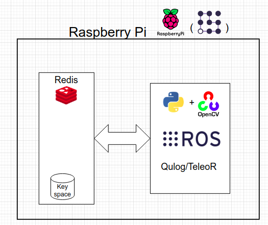

# Robot Controller

This module constitutes the controller of the robot.  

## Goal
The goal of the project is to search for an object and take it.

In particular the main goal can be divided in the following steps:
- listen to the object to take: provide a human interface with speech-recognition and speech-to-text functions.
- look for the object: given the images provided by the robot camera, make object detection to see where the object is
- move: we have to deal with the movement of the robot towards the object, and in general in complex environment
- take the object: once reached, grab the object with the hands.

## Assumptions
0. Simple environment: we assume the robot in a plan room where the object can be directly seen.
We didn't implement functions to navigate through a labyrinth. 
0. Given the complexity to take a generic object from the ground without falling,
we assume that the object is raised from the ground (e.g. some shelf or small table)

## Description
For this scope we use the interface developed in the NAO_interface module.
Said module provides an interface with NAO through a Redis database,
making use of its channel and keys to provide perceptions and execute commands.

### Controllers
We provided several different sub-modules (architectures) that use different
technologies or languages.

Every module is described below:
* simple
* ros
* qulog

### simple
This controller is the first version of the robot controller.
It models the Robot in the homonym class, which describes all the current perceptions and available methods.

It's able to react to external events, such as obstacles and falling.
It all written in Python3

### ROS
This architecture uses the ROS framework to implement the logic.
ROS is a standard de-facto for the realization of intelligent agents.

In particular we created several independent nodes and services.
All of them are used inside the main node. 

### QuLog / TeleoR
QuLog is a declarative language we used to implement the logic
for moving towards the object.

The elaboration of the raw data, as well as the Object Detection,
is performed by Python at a lower level of abstraction.
Then all the perceptions are shared with the QuLog Belief Store

The program takes care of choose the next action based on the current received perception.
All of this can be easily made in a high level, declarative language: QuLog.

All the perceptions (both received and elaborated) are sent to QuLog through a Pedro server.
On the other way around, all the commands from QuLog are sent too through the Pedro server.

